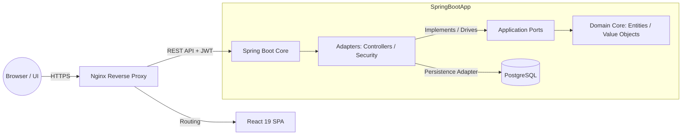

# Millete — Agent Context

> **Purpose:** This file provides everything an AI coding agent needs to know about the Millete project. It is written in English because the project's code comments and documentation are mixed (Spanish backend docs, English frontend docs). When in doubt, default to English for code and Spanish for user-facing text.

---

## 1. Project Overview

**Millete** is a production-ready, self-hosted personal finance platform. It tracks income/expenses, manages recurring bills, monitors investment portfolios, and enables secure family-unit collaboration.

- **Live URL:** https://www.millete.online
- **Version:** 0.1.2
- **Architecture:** Hexagonal / Domain-Driven Design (DDD) with a decoupled frontend/backend.

### Architecture Diagram (Mermaid)



### Key Principles

- **Pure Domain Core:** Business logic has zero dependencies on frameworks, databases, or external libraries. This guarantees maximum testability.
- **Strict Anti-IDOR Layer:** Every database transaction validates cross-entity resource ownership dynamically against the authenticated context.

---

## 2. Technology Stack

### Backend

| Layer | Technology | Version |
|-------|------------|---------|
| Language | Java | 25 (LTS) |
| Framework | Spring Boot | 4.0.6 |
| Security | Spring Security, JWT (jjwt), BCrypt | — |
| Persistence | Hibernate ORM, PostgreSQL | 16 |
| Migrations | Flyway | — |
| Build Tool | Maven | — |
| Utilities | Lombok, MapStruct | 1.18.40, 1.6.3 |
| PDF/HTML | Apache PDFBox, Flying Saucer, Thymeleaf | — |
| CSV | Apache Commons CSV | — |
| Encryption | Jasypt | 3.0.5 |

### Frontend

| Layer | Technology | Version |
|-------|------------|---------|
| Framework | React | 19.2.5 |
| Language | TypeScript | ~6.0.2 |
| Bundler | Vite | 8.0.10 |
| Styling | Tailwind CSS | 4.2.4 |
| UI Library | shadcn/ui + Radix UI | — |
| State (Server) | TanStack Query (React Query) | 5.100.8 |
| HTTP Client | Axios | 1.16.0 |
| Routing | React Router DOM | 7.14.2 |
| Forms | React Hook Form + Zod | 7.75.0, 4.4.3 |
| i18n | i18next, react-i18next | 26.0.8 |
| Icons | Lucide React | 1.14.0 |
| Notifications | Sonner | 2.0.7 |
| Animation | Framer Motion | 12.41.0 |
| Package Manager | pnpm | 11.7.0 (enforced) |

### Infrastructure

- **Containerization:** Docker + Docker Compose
- **Reverse Proxy:** Nginx (Alpine, rootless)
- **Database:** PostgreSQL 16 (Alpine)
- **Backups:** Automated daily at 02:00 AM, 7-day retention

---

## 3. Project Structure

```
millete/
├── backend/          # Spring Boot application (Java 25)
│   ├── src/main/java/com/puntomartinez/millete/
│   │   ├── categories/
│   │   ├── dashboard/
│   │   ├── dataexport/
│   │   ├── groupgoals/
│   │   ├── investments/
│   │   ├── notifications/
│   │   ├── plannedtransactions/
│   │   ├── savingsgoals/
│   │   ├── shared/           # Security, config, exceptions, global advice
│   │   ├── transactions/
│   │   └── users/
│   ├── src/test/java/...   # Unit tests (JUnit, Mockito)
│   ├── src/main/resources/
│   │   ├── application.yml
│   │   ├── db/migration/     # Flyway SQL migrations
│   │   └── templates/          # Thymeleaf templates for PDF export
│   ├── pom.xml
│   └── Dockerfile
├── frontend/         # React 19 SPA (TypeScript + Vite)
│   ├── src/
│   │   ├── app/              # Router, global layout
│   │   ├── assets/locales/   # i18n translation files (es, en, de, fr, it, ja, pt)
│   │   ├── features/         # Feature-based modules
│   │   │   ├── auth/
│   │   │   ├── categories/
│   │   │   ├── dashboard/
│   │   │   ├── groupgoals/
│   │   │   ├── investments/
│   │   │   ├── notifications/
│   │   │   ├── profile/
│   │   │   ├── savingsgoals/
│   │   │   ├── transactions/
│   │   │   └── wiki/
│   │   ├── lib/              # i18n setup, utilities
│   │   └── shared/           # API client, components, hooks, themes, utils
│   ├── package.json
│   ├── vite.config.ts
│   ├── tsconfig.json / tsconfig.app.json / tsconfig.node.json
│   ├── eslint.config.js
│   ├── components.json       # shadcn/ui configuration
│   └── Dockerfile
├── scripts/          # Shell scripts for DB init and restore
├── documentation/    # Markdown docs for backend and frontend modules
├── docker-compose.yml
├── manage.sh         # Unified management script
├── .env.example
└── AGENTS.md         # This file
```

### Backend Module Layout (Hexagonal Architecture)

Each domain module (e.g., `categories`, `transactions`) follows the same package structure:

```
com.puntomartinez.millete.<module>/
├── application/services/          # Application services (orchestration)
├── domain/
│   ├── model/                   # Entities, Value Objects, Enums
│   ├── ports/
│   │   ├── in/                  # Use cases (interfaces) + Commands
│   │   └── out/                 # Repository interfaces (driven ports)
│   └── utils/                   # Domain-specific helpers (if any)
├── infrastructure/
│   ├── in/
│   │   └── controller/          # REST controllers + DTOs
│   └── out/
│       └── persistence/
│           └── postgresql/      # JPA entities, adapters, mappers, repositories
```

**Rules:**
- Domain classes must NOT import Spring, Jakarta, or any framework annotations.
- Infrastructure adapters implement the `out` ports.
- Controllers call application services, which call domain logic through `in` ports.

### Frontend Module Layout (Feature-Based)

```
src/features/<feature>/
├── components/          # React components (subfolders allowed)
├── hooks/               # TanStack Query hooks, custom hooks
├── pages/               # Route-level page components
├── services/            # API service functions (thin wrappers around axios)
├── types/               # TypeScript interfaces/types
├── schemas/             # Zod validation schemas
└── constants.ts         # Feature constants
```

Shared code lives in `src/shared/` and `src/lib/`.

---

## 4. Build & Development Commands

### Prerequisites

- Docker 24.0+ and Docker Compose 2.0+
- Git Bash (on Windows) or any POSIX shell
- Node.js >= 20 and pnpm >= 11 (for local frontend dev only)
- Java 25 and Maven 3.9+ (for local backend dev only)

### Environment Setup

1. Copy environment file:
   ```bash
   cp .env.example .env
   ```
2. Edit `.env` with strong passwords (generate with `openssl rand -base64 32`).

### Management Script (`manage.sh`)

| Command | Description |
|---------|-------------|
| `sh manage.sh init` | Create Docker volume, fix permissions, prepare scripts |
| `sh manage.sh start` | Start all services in background |
| `sh manage.sh stop` | Stop services (preserve data) |
| `sh manage.sh restart` | Quick restart (ignores config changes) |
| `sh manage.sh reload` | Rebuild images and recreate containers |
| `sh manage.sh down` | Stop and remove containers/networks |
| `sh manage.sh status` | Show container health and recent backups |
| `sh manage.sh logs [svc]` | Tail logs (optionally filter by service) |
| `sh manage.sh backup-now` | Manual database backup |
| `sh manage.sh restore` | Interactive database restoration wizard |
| `sh manage.sh create-app-user` | Create `millete_app` DB user |
| `sh manage.sh clean-all` | **DESTRUCTIVE:** wipe everything |

### Frontend-Only (Local Development)

```bash
cd frontend
pnpm install
pnpm dev          # Vite dev server on http://localhost:5173
pnpm build        # Production build
pnpm type-check   # TypeScript check only
pnpm lint         # ESLint check
pnpm lint:fix     # Auto-fix ESLint issues
pnpm preview      # Preview production build
```

### Backend-Only (Local Development)

```bash
cd backend
./mvnw clean package -DskipTests   # Build JAR
./mvnw test                        # Run tests
./mvnw spring-boot:run             # Run locally (requires local PostgreSQL)
```

**Note:** `application.yml` has hardcoded dev credentials for local IntelliJ runs. Do not commit production secrets.

---

## 5. Testing Strategy

### Backend Tests

- **Framework:** JUnit 5 + Mockito (via `spring-boot-starter-test`)
- **Location:** `backend/src/test/java/...`
- **Coverage:** Unit tests for application services, domain models, controllers, and infrastructure adapters.
- **Naming:** `*Test.java` (e.g., `UserServiceTest.java`)
- **Run:** `./mvnw test`

### Frontend Tests

- **Current Status:** The project does **not** currently have frontend unit tests. There are no `*.test.ts` or `*.spec.tsx` files in `frontend/src/`.
- **If adding tests:** Use Vitest (consistent with Vite) + React Testing Library + Jest DOM matchers.

### Integration / E2E

- No E2E test suite is currently configured. The project relies on Docker Compose healthchecks and manual QA.

---

## 6. Code Style Guidelines

### Java (Backend)

- **Language Level:** Java 25
- **Framework:** Spring Boot 4.x
- **Lombok:** Use `@Getter`, `@Setter`, `@Builder`, `@RequiredArgsConstructor` aggressively. Do not write boilerplate getters/setters.
- **MapStruct:** Use for DTO <-> Entity mapping. Define mappers as interfaces with `@Mapper`.
- **JPA:** Use `UUID` for primary keys. Enable `ddl-auto: validate` (never `create-drop` in production).
- **Logging:** Use `@Slf4j` from Lombok. Log client errors at `warn`, server errors at `error` with stack traces.
- **Exceptions:** Throw domain exceptions from `shared.domain.exception`. Never leak raw stack traces to the client.
- **Security:** All endpoints under `/api/v1` require authentication except `POST /api/v1/auth/register` and `POST /api/v1/auth/login`.

### TypeScript / React (Frontend)

- **TypeScript:** Strict mode enabled. Target `es2023`.
- **Imports:** Use `@/` alias for project imports. Use `import type` for type-only imports (`verbatimModuleSyntax` is enabled).
- **Components:** Functional components with hooks. No class components.
- **Styling:** Tailwind CSS v4 with utility classes. Use `cn()` utility from `@/lib/utils` for conditional class merging.
- **Forms:** React Hook Form + Zod for validation. Define schemas in `features/<feature>/schemas/`.
- **API Calls:** Use TanStack Query hooks in `features/<feature>/hooks/`. Services in `features/<feature>/services/` should be thin axios wrappers.
- **i18n:** All user-facing strings must be translated. Translation keys are namespaced (e.g., `api:errors.default`).
- **ESLint Rules:**
  - `no-console`: warn (only `console.warn` and `console.error` allowed)
  - `no-debugger`: warn
  - `@typescript-eslint/no-unused-vars`: warn (ignore `_` prefix)
  - `@typescript-eslint/no-explicit-any`: warn
  - `react-refresh/only-export-components`: warn
  - `react-hooks/set-state-in-effect`: warn

---

## 7. API & Security

### Authentication

- **Mechanism:** Stateless JWT (12-hour expiration)
- **Token Storage:** HttpOnly cookie (`ms_token`) + `Authorization: Bearer <token>` header
- **Cookie Flags:** `HttpOnly=true`, `SameSite=Strict`, `Secure=false` in dev (`true` in prod)
- **Password Hashing:** BCrypt

### Rate Limiting & Brute Force Protection

1. **IP-based rate limiting:** `LoginRateLimitFilter` limits login to 5 attempts/minute per IP. Uses in-memory `ConcurrentHashMap`.
2. **Account locking:** `AccountLockService` locks a user account for 15 minutes after 5 consecutive failed login attempts. Persisted in `user_sessions` table.

### CORS

- Configured via `CORS_ALLOWED_ORIGINS` env variable.
- Default dev origin: `http://localhost:5173`
- Credentials enabled.

### API Client (Frontend)

- `apiClient` is an Axios instance in `src/shared/api/axiosClient.ts`.
- Base URL: `import.meta.env.VITE_API_URL` (default `/api/v1` in Docker, `http://localhost:8080/api/v1` in local dev).
- Interceptors: 401 clears storage and redirects to `/login`. Global error notifications via Sonner (unless `skipGlobalErrorNotify` is set).

---

## 8. Database & Migrations

- **Database:** PostgreSQL 16
- **Migrations:** Flyway
- **Migration Files:** `backend/src/main/resources/db/migration/`
  - `V1__initial_schema.sql` — Initial schema (users, family units, categories, transactions, planned transactions, investments)
  - `V2__v0.1.0.sql` — v0.1.0 updates
- **App User:** `millete_app` (minimal privileges). Superuser `postgres` only for backups.
- **Schema Rules:**
  - Use `UUID` for all primary keys.
  - Use `active BOOLEAN DEFAULT TRUE` for soft deletes.
  - Include `created_at` and `modified_at` timestamps on all tables.
  - Use `CHECK` constraints for enums and business rules.

---

## 9. Deployment & Operations

### Docker Compose Services

| Service | Container Name | Port (Host) | Description |
|---------|----------------|-------------|-------------|
| PostgreSQL | `millete-db` | — (internal) | Database |
| Backend | `millete-backend` | — (internal) | Spring Boot API |
| Frontend | `millete-frontend` | `3000` | Nginx serving React SPA |
| Backup | `millete-db-backup` | — | Daily cron backup |

### Nginx Routing

- `/` → Serves React SPA static files
- `/api/v1` → Proxies to `millete-backend:8080`

### Backup & Restore

- **Automatic:** Daily at 02:00 AM, 7-day retention.
- **Manual:** `sh manage.sh backup-now`
- **Restore:** `sh manage.sh restore` (interactive wizard)
- **Storage:** `./backups/` directory on host.

### Production Checklist

- Change all passwords in `.env`.
- Set `JWT_SECRET` to a strong 64-char base64 string.
- Set `CORS_ALLOWED_ORIGINS` to your actual domain(s).
- Set `cookie-secure: true` in backend config (requires HTTPS).
- Backend port `8080` must **not** be exposed to the host.

---

## 10. Security Considerations

- **No root containers:** All containers run as non-root users (`millete-user` UID 1001, `millete` UID 1001).
- **External volume:** `millete_postgres_data` persists across container removals.
- **Anti-IDOR:** Every service method validates that the authenticated user owns the requested resource.
- **Input Validation:** DTOs use Jakarta Validation (`@NotBlank`, `@Size`, etc.).
- **Error Obfuscation:** Generic 500 messages are returned to clients; details are logged server-side.
- **Jasypt:** Sensitive properties in `application.yml` can be encrypted with Jasypt.

---

## 11. Common Pitfalls for Agents

1. **Do not use `npm` or `yarn` in the frontend.** The project enforces `pnpm` via `only-allow`.
2. **Do not add framework annotations to domain classes.** Keep `domain/` packages pure.
3. **Do not expose backend port 8080 in production.** All traffic must flow through Nginx.
4. **Do not forget i18n.** Any new user-facing text needs a translation key.
5. **Do not use `console.log` in production frontend code.** ESLint will warn; Terser will strip it in production builds anyway.
6. **Do not modify Flyway migrations that have already been applied.** Create new `V<N>__description.sql` files instead.
7. **Windows users must use Git Bash** for `manage.sh` and other shell scripts.
8. **When adding a new backend module,** follow the exact hexagonal package structure (`domain/ports/in`, `domain/ports/out`, `application/services`, `infrastructure/in/controller`, `infrastructure/out/persistence/postgresql`).
9. **When adding a new frontend feature,** create a folder under `src/features/<feature>/` with `components/`, `hooks/`, `pages/`, `services/`, `types/`, and `schemas/`.

---

## 12. Useful Documentation Files

- `README.md` — High-level overview, quick start, feature list.
- `CHANGELOG.md` — Version history.
- `SECURITY.md` — Security policy and reporting.
- `documentation/back/*.md` — Detailed backend module documentation (in Spanish).
- `documentation/front/*.md` — Detailed frontend module documentation (in Spanish).

---

*Last updated: 2026-07-07*
