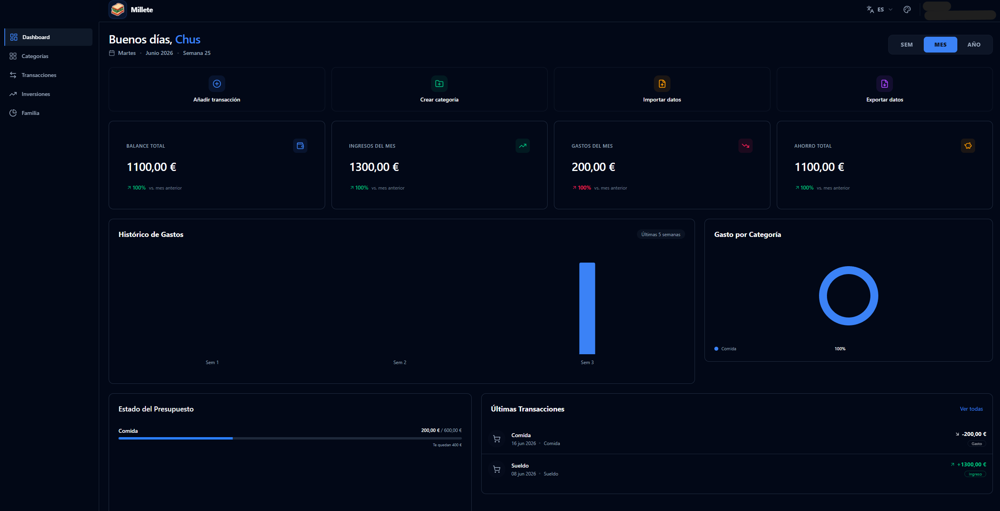
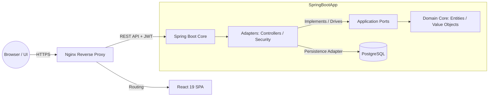

# Millete – Personal Finance Enterprise Web App

  
  
  
  
  

**Millete** is a production-ready, self-hosted personal finance platform engineered to track income/expenses, manage automated recurring bills, monitor complex investment portfolios, and enable secure family-unit collaboration—all powered by a decoupled, high-performance architecture.

**Live Production Environment:** https://www.millete.online

---

## Preview & Interface

  

---

## Architecture & Core Principles

This project abandons traditional monolithic coupling in favor of **Domain-Driven Design (DDD)** and **Hexagonal Architecture (Ports & Adapters)**.

### Architectural Flow Diagram

* **Pure Domain Core:** The business logic has zero dependencies on frameworks, databases, or external libraries, guaranteeing maximum testability and long-term maintainability.
* **Strict Anti-IDOR Layer:** Security is treated as a core architectural constraint. Every single database transaction validates cross-entity resource ownership dynamically against the authenticated context.

---

## Key Features

* **Advanced Dashboard:** High-fidelity data visualization using **Recharts** displaying spending trends, localized budget metrics, and historical financial performance.
* **Automated Recurring Transactions:** Integrated cron-like background routine driven by **Spring Scheduled Tasks**.
* **Enterprise Investment Ledger:** Monitors assets (Stocks, Crypto, Real Estate) providing real-time calculations for invested capital, market valuations, and ROI percentage.
* **Family Collaboration Units:** Isolated micro-ecosystem supporting invitation flows and customized contribution models.
* **Data Portability:** Complete user data extraction into versioned JSON files with automated schema-migration layers, csv or PDF.

---

## Tech Stack

### Backend & Infrastructure
* **Core:** Java 25 (LTS) & Spring Boot 4.x Framework.
* **Security:** Spring Security, Stateless JWT Architecture (12-hour expiration), BCrypt password hashing.
* **Persistence & Migrations:** PostgreSQL, Hibernate ORM, **Flyway** (Evolutionary automated schema management).

### Frontend
* **Core & State:** React 19, TypeScript, Vite, **TanStack Query (React Query)** for server-state synchronization.
* **UI/UX:** Tailwind CSS, **Shadcn/ui**, Radix UI primitives, Sonner notifications.