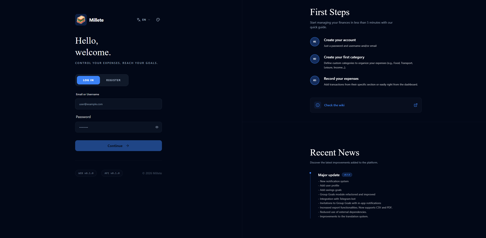
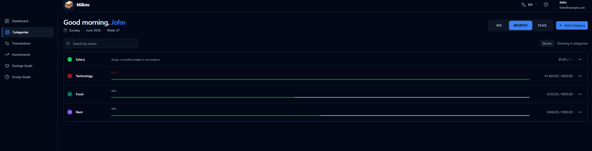
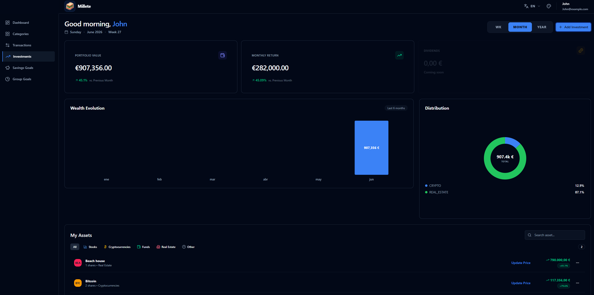
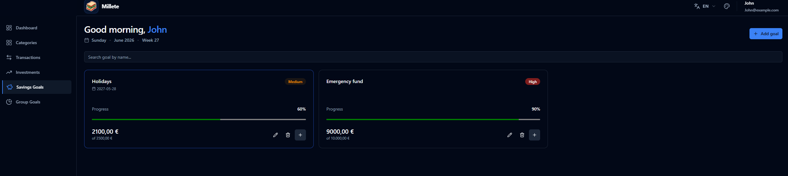
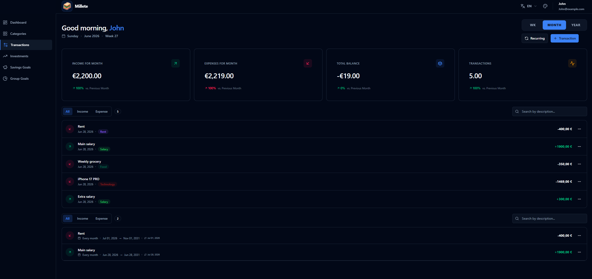
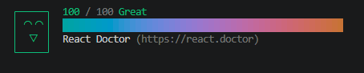
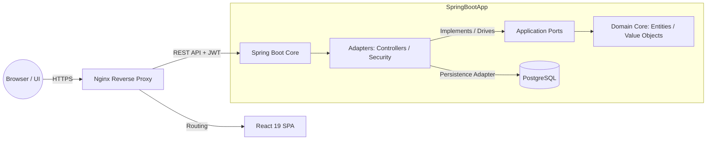

# Millete – Personal Finance Enterprise Web App

<p align="center">
  
  
  
  
  
</p>

**Millete** is a production-ready, self-hosted personal finance platform engineered to track income/expenses, manage automated recurring bills, monitor complex investment portfolios, and enable secure family-unit collaboration—all powered by a decoupled, high-performance architecture.

**Live Production Environment:** https://www.millete.online

---

## Preview & Interface

### Core Dashboard
<p align="center">
  
</p>

### Modules & Features

| Secure Access | 📑 Ledger & Categories |
|---|---|
| **Login Interface** <br>  | **Category Management** <br>  |
| **Investment Monitoring** | **Financial Goals** |
| **Portfolio Tracker** <br>  | **Saving Goals** <br>  |

### Cash Flow & Value Analysis
<p align="center">
  <b>Detailed Transactions Management</b>
  
</p>

<p align="center">
  <b>System Value Metrics (React Doctor)</b> <br>
  
</p>

---

## Architecture & Core Principles

This project abandons traditional monolithic coupling in favor of **Domain-Driven Design (DDD)** and **Hexagonal Architecture (Ports & Adapters)**.

### Architectural Flow Diagram



* **Pure Domain Core:** The business logic has zero dependencies on frameworks, databases, or external libraries, guaranteeing maximum testability and long-term maintainability.
* **Strict Anti-IDOR Layer:** Security is treated as a core architectural constraint. Every single database transaction validates cross-entity resource ownership dynamically against the authenticated context.

---

## Key Features

* **Advanced Dashboard:** High-fidelity data visualization using **Recharts** displaying spending trends, localized budget metrics, and historical financial performance.
* **Automated Recurring Transactions:** Integrated cron-like background routine driven by **Spring Scheduled Tasks**.
* **Enterprise Investment Ledger:** Monitors assets (Stocks, Crypto, Real Estate) providing real-time calculations for invested capital, market valuations, and ROI percentage.
* **Family Collaboration Units:** Isolated micro-ecosystem supporting invitation flows and customized contribution models.
* **Data Portability:** Complete user data extraction into versioned JSON files with automated schema-migration layers, csv or PDF.

---

## Quick Start

Get Millete up and running locally in under 5 minutes using Docker Compose.

### Prerequisites

* [Docker](https://docs.docker.com/get-docker/) (version 24.0+)
* [Docker Compose](https://docs.docker.com/compose/install/) (version 2.0+)
* [Git](https://git-scm.com/downloads)

### 1. Clone the Repository

```bash
git clone https://github.com/puntomartinez/millete.git
cd millete
```

### 2. Configure Environment Variables

```bash
cp .env.example .env
```

Edit `.env` with your preferred values. The defaults work out of the box for local development, but **make sure to change all passwords for production use**.

> **Security Note:** Generate strong passwords using:
> ```bash
> openssl rand -base64 32
> ```

### 3. Initialize the Environment

**Linux / macOS / WSL:**
```bash
chmod +x manage.sh scripts/*.sh
sh manage.sh init
```

**Windows (Git Bash):**
```bash
sh manage.sh init
```

> **Windows Users:** Always use **Git Bash** to run shell scripts. PowerShell and CMD will not execute `.sh` files correctly.

The `init` command performs the following setup tasks:
- Creates the external Docker volume `millete_postgres_data` (if it doesn't exist)
- Creates the `backups/` directory with proper permissions (UID 1000) for the Alpine-based backup container
- Makes all shell scripts executable
- Converts script line endings to Unix format automatically

### 4. Start All Services

```bash
sh manage.sh start
```

Docker Compose will build and launch all four services:

| Service | Container Name | Technology | Port |
|---------|---------------|------------|------|
| Database | `millete-db` | PostgreSQL 16 (Alpine) | 5432 (internal) |
| Backend | `millete-backend` | Spring Boot 4 + Java 25 | 8080 (internal) |
| Frontend | `millete-frontend` | React 19 + Vite + Nginx | 3000 (exposed) |
| Backups | `millete-db-backup` | PostgreSQL 16 (Alpine) | N/A |

### 5. Access the Application

Open your browser and navigate to: http://localhost:3000


The backend API is proxied through Nginx at `/api/v1`. You can register a new account directly from the login page.

> **First Run Note:** If the database volume already existed from a previous deployment, the application user `millete_app` may not have been created automatically. Run this command once to create it:
> ```bash
> sh manage.sh create-app-user
> ```

---

## Management Script Reference

The `manage.sh` script provides a unified interface for all common operations:

| Command | Description |
|---------|-------------|
| `sh manage.sh start` | Start all services in the background |
| `sh manage.sh stop` | Stop running services without removing them |
| `sh manage.sh restart` | Quickly restart containers (ignores config/.env updates) |
| `sh manage.sh reload` | Rebuild images and recreate containers with new configs |
| `sh manage.sh down` | Stop and remove containers and networks |
| `sh manage.sh status` | Display container health and list recent backups |
| `sh manage.sh logs [svc]` | Tail logs (optionally filter by service name) |
| `sh manage.sh backup-now` | Trigger an instantaneous manual database backup |
| `sh manage.sh restore` | Launch interactive database restoration wizard |
| `sh manage.sh init` | Bootstrap volumes and host directory permissions |
| `sh manage.sh create-app-user` | Create `millete_app` user in existing database |
| `sh manage.sh clean-all` | WIPE everything (containers, volumes, and backups) |

### Common Workflows

**View real-time logs:**
```bash
sh manage.sh logs backend
```

**Rebuild after code changes:**
```bash
sh manage.sh reload
```

**Manual database backup:**
```bash
sh manage.sh backup-now
```

**Restore from a previous backup:**
```bash
sh manage.sh restore
```

---

## Production Deployment Notes

- The backend port (`8080`) is **not exposed** to the host machine. All API traffic flows through Nginx.
- The database uses a dedicated application user (`millete_app`) with minimal privileges. The superuser (`postgres`) is only used for backups.
- Automated daily backups run at 2:00 AM with a 7-day retention policy.
- All containers run as non-root users for security.
- The external Docker volume `millete_postgres_data` persists data across container rebuilds and removals.


## Tech Stack

### Backend & Infrastructure
* **Core:** Java 25 (LTS) & Spring Boot 4.x Framework.
* **Security:** Spring Security, Stateless JWT Architecture (12-hour expiration), BCrypt password hashing.
* **Persistence & Migrations:** PostgreSQL, Hibernate ORM, **Flyway** (Evolutionary automated schema management).

### Frontend
* **Core & State:** React 19, TypeScript, Vite, **TanStack Query (React Query)** for server-state synchronization.
* **UI/UX:** Tailwind CSS, **Shadcn/ui**, Radix UI primitives, Sonner notifications.